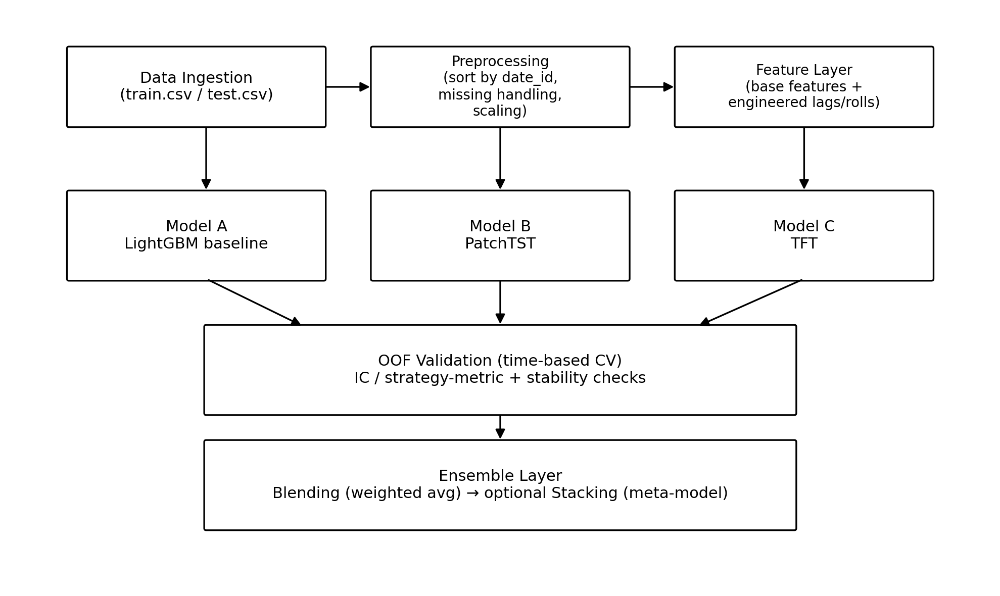
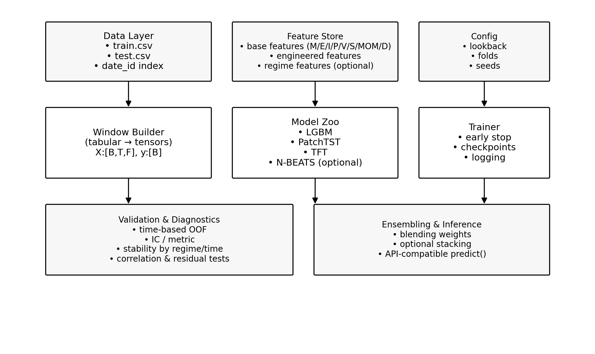

# **Project Proposal**

## Title: Hull Tactical - Market Prediction

- Your proposal should state the **Title, Objective, Motivation, Requirements, and Milestones** of the project. The marking will consider the clarity of these parts.

## **Objective**

The objective of this project is to investigate whether systematic, data-driven modeling can uncover repeatable excess return signals in the U.S. equity market that are not fully explained by classical notions of market efficiency. The study focuses on predicting next-day excess returns of the S&P 500, or an equivalent daily allocation signal, using a single-index daily time series under strict causal constraints that prohibit any form of forward-looking information. The available historical data includes extensive missing values, which must be handled carefully to ensure that feature construction, preprocessing, and model estimation remain leakage-free. To address these challenges, the project develops a reproducible end-to-end modeling pipeline spanning causal feature and time-window construction, model training, strict time-ordered out-of-fold evaluation, ensemble combination, and deployment-ready inference suitable for real-time decision-making. The modeling framework integrates complementary model families, including nonlinear tree-based methods and deep time-series architectures,  to capture both cross-feature interactions and longer-horizon temporal dynamics such as regime shifts and delayed information assimilation. Model outputs are combined through an ensemble strategy that prioritizes robustness and generalization, favoring stable blending approaches and employing conservative stacking only when improvements are consistent under out-of-fold stability analysis. Ultimately, the objective is to produce a risk-aware forecasting and allocation framework whose performance reflects genuine predictive structure rather than overfitting or information leakage, thereby providing empirical insight into the limits of market efficiency and the practical potential of modern machine learning in financial markets.

## **Motivation**

The current modeling approach relies primarily on manually engineered lag and rolling features, which limits the ability to capture temporal structure in an end-to-end manner. While such approaches perform well as tabular baselines, they are inherently constrained in learning longer-horizon dependencies, regime shifts, and sequence-level patterns that may be critical for modeling market dynamics. This limitation suggests a potential performance ceiling when predictive signals depend on interactions that unfold across time rather than within a single observation. Moreover, the task is subject to strict time-series constraints, including an inference setting that prohibits any form of forward-looking information, making conventional validation and feature engineering particularly prone to leakage if not handled carefully. As a result, improvements must come not from more aggressive feature reuse or single-split optimization, but from modeling approaches that capture complementary information and demonstrate stable generalization under time-ordered out-of-fold evaluation. These considerations motivate the exploration of models and validation strategies that explicitly address temporal dependence and robustness, rather than focusing solely on short-term predictive gains.

## **Requirements**

The final submission should satisfy the following requirements, while allowing flexibility in specific modeling and implementation choices.

1. The modeling framework should include at least one strong baseline model suitable for tabular data and may incorporate additional sequence-based models designed to capture longer-horizon temporal dependencies, provided they are evaluated under the same validation protocol.
2. Model evaluation must be conducted using time-based validation, such as rolling or expanding window splits, and out-of-fold predictions must be generated to assess generalization and support any subsequent ensembling.
3. The solution must model the problem as a strictly time-ordered single time series and ensure that all feature construction, preprocessing, and model training adhere to causal constraints, with no use of forward-looking information.
4. Any ensemble or combination of models must be trained exclusively on out-of-fold predictions to prevent optimistic bias, with robustness and stability prioritized over single-split performance gains.
5. The final system should be reproducible and suitable for real-time inference, including consistent preprocessing, controlled randomness, and practical runtime considerations.

## Proposed Workflow and System Architecture

Figure 1 shows the end-to-end modeling workflow. Figure 2 shows the proposed modular architecture.

*Figure 1. End-to-end workflow (data → features → models → OOF validation → ensemble).*

*Figure 2. Project architecture (data/feature store, window builder, model zoo, trainer, validation, ensemble, inference).*

## Model Plan and Comparative Analysis

We will train three primary model families and evaluate them under a shared time-based OOF protocol. The emphasis is on complementary information capture and stable generalization, rather than single-split gains.

## 5.1 Model comparison (for this dataset)

| Model                             | What it captures                                             | Pros                                                         | Cons / risks                                                 | Role in ensemble                               |
| --------------------------------- | ------------------------------------------------------------ | ------------------------------------------------------------ | ------------------------------------------------------------ | ---------------------------------------------- |
| LightGBM (baseline)               | Nonlinear factor interactions in tabular  features           | Fast, robust, strong baseline; handles  missingness well     | Limited long-horizon sequence learning;  relies on engineered lags | Anchor / main component                        |
| PatchTST                          | Long-range multivariate temporal patterns  via patching      | Strong long-horizon modeling; simpler  than TFT; often good generalization | Requires windowing + scaling; sensitive  to lookback choice  | Complementary time-structure model             |
| Temporal Fusion Transformer (TFT) | Conditional feature importance + regime  effects with attention | Powerful covariate modeling;  interpretable attention/feature gates | Heavy training; overfit risk; pipeline  complexity           | High-upside component, small-to-medium  weight |
| N-BEATS (optional)                | Trend/seasonal decomposition on  target/history              | Simple training; good as ablation/sanity  baseline           | Weak covariate use; may add little on  noisy returns         | Optional auxiliary model                       |

## Milestones

The following milestones are to be accomplished through semester.  

| Phase               | Scope                                        | Deliverables                                                 |
| ------------------- | -------------------------------------------- | ------------------------------------------------------------ |
| Phase 1 (1-2 weeks) | Validation hardening + OOF pipeline          | Time-based CV module; OOF store; baseline  LGBM score & stability report |
| Phase 2 (1-2 weeks) | PatchTST implementation + tuning             | PatchTST training/inference; OOF  predictions; LGBM+PatchTST blending |
| Phase 3 (2-3 weeks) | TFT implementation + careful  regularization | TFT OOF; diagnostics; tri-model blending;  optional regime-weighting |
| Phase 4 (ongoing)   | Finalize ensemble + runtime optimization     | Final submission candidates; ablation  report; reproducible inference notebook |

## References (selected)

- Oreshkin et al. (2019). N-BEATS: Neural basis expansion analysis for interpretable time series forecasting.
-  Lim et al. (2021). Temporal Fusion Transformers for interpretable multi-horizon time series forecasting.
- Nie et al. (2023). PatchTST: Long-term time series forecasting with patch-based transformers.
- Lopez de Prado (2018). Advances in Financial Machine Learning (validation and leakage controls).

